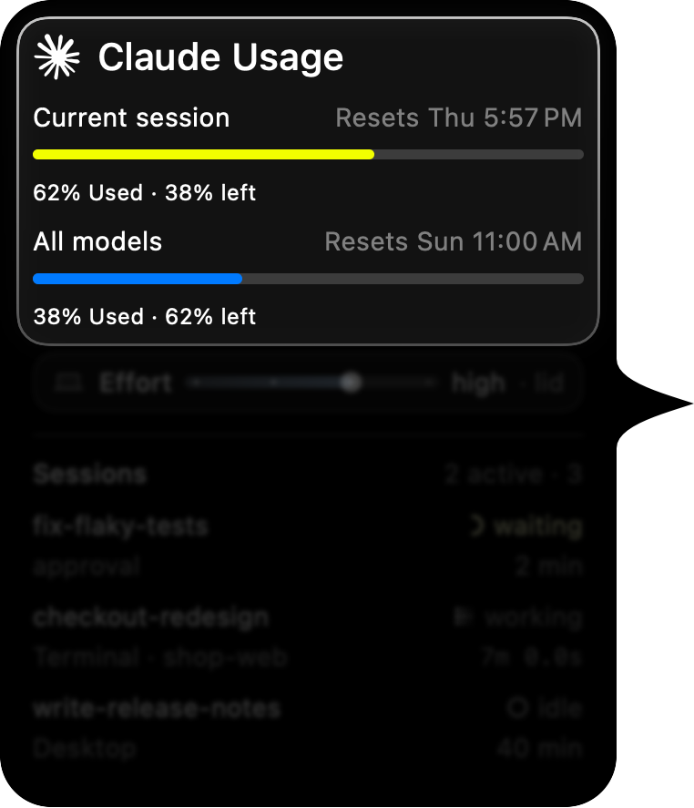
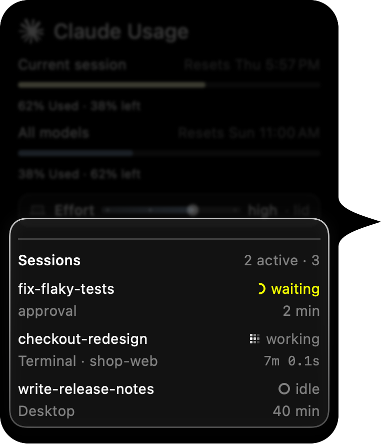
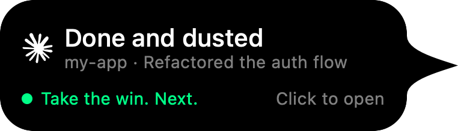
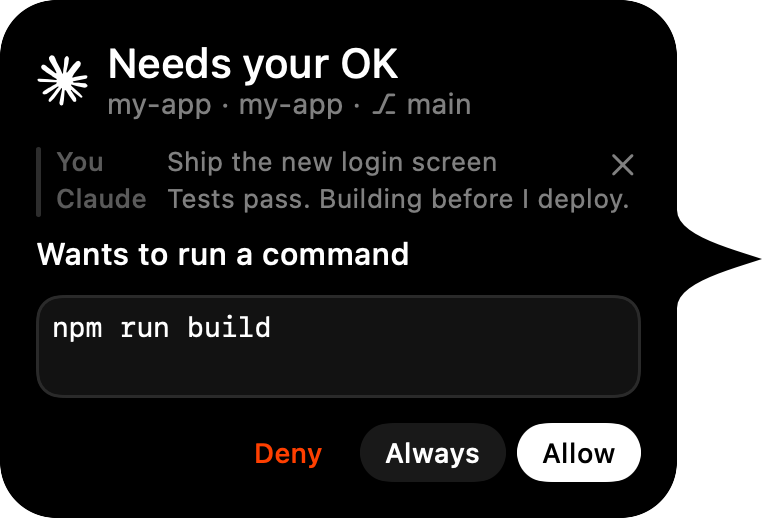
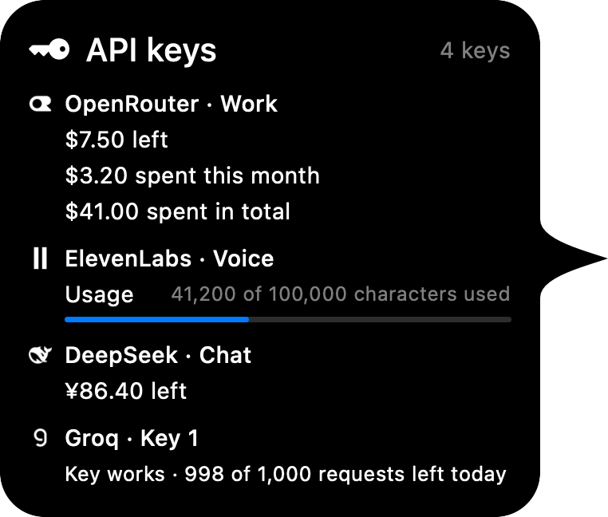
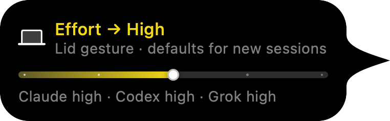

<p align="center">
  <a href="https://pillr.lol">
    <picture>
      <source media="(prefers-color-scheme: dark)" srcset="docs/media/lockup-white.png">
      
    </picture>
  </a>
</p>

<h3 align="center">Every coding agent and every API key,<br>in one small pill at the edge of your Mac.</h3>

<p align="center">
  <a href="https://github.com/chrisnguyen1211/pillrdotlol/releases/latest"></a>
  
  
  <a href="LICENSE"></a>
  
</p>

<p align="center">
  <a href="https://github.com/chrisnguyen1211/pillrdotlol/releases/latest"></a>
  &nbsp;
  <a href="https://pillr.lol"></a>
</p>

<p align="center">
  
</p>

> [!NOTE]
> **spyx is now pillr.** Same app, new name. Installed copies update themselves and keep their settings, API keys, history, sign-ins and agent hooks.

<table>
  <tr>
    <td align="center" width="25%"><b>🧭 Limits</b><br><sub>A ring per agent, with a forecast before it runs out</sub></td>
    <td align="center" width="25%"><b>🔔 Done cards</b><br><sub>The moment a turn ends, from each agent's own hook</sub></td>
    <td align="center" width="25%"><b>🔑 API keys</b><br><sub>Credit left and spend for about 70 providers</sub></td>
    <td align="center" width="25%"><b>🎚️ The lid</b><br><sub>Hold ⌘ and tilt it to set reasoning effort</sub></td>
  </tr>
</table>

## ✨ What it does

<table>
  <tr>
    <td width="46%"></td>
    <td>
      <h3>Know before you hit the wall</h3>
      A ring for each agent shows how much of its limit is left. Hover for the card: every window, when it resets, and a forecast when you'll run out before it does. When a limit comes back, a card says so.
    </td>
  </tr>
  <tr>
    <td>
      <h3>Every session, one hover away</h3>
      See what each agent is doing — its model, reasoning effort, tokens and how long it's been at it. Click a session to jump straight to its terminal tab or app window.
    </td>
    <td width="46%"></td>
  </tr>
  <tr>
    <td width="46%"></td>
    <td>
      <h3>Finished? You'll know</h3>
      Ten agents tell pillr the moment a turn ends — Claude Code, Codex, Grok, Cursor, Kimi Code, Gemini CLI, OpenCode, Copilot CLI, Droid and Antigravity. Hover an idle session to <b>Reply</b> right from its card: pillr types it in only when the agent is waiting, never over a draft.
    </td>
  </tr>
  <tr>
    <td>
      <h3>Approve without leaving your flow</h3>
      Allow or deny Claude Code's permission prompts, and answer its questions, from the notch. Your answer goes straight back to the session that asked.
    </td>
    <td width="46%"></td>
  </tr>
  <tr>
    <td width="46%"></td>
    <td>
      <h3>No more keys burning in the dark</h3>
      Paste the API keys you pay for and pillr keeps an eye on all of them: <b>credit left</b>, <b>spent this month</b> and <b>spent in total</b>, read from each provider's own API. They share one <b>API keys</b> cell — its ring follows the key closest to running out.
    </td>
  </tr>
  <tr>
    <td>
      <h3>Hold ⌘. Tilt the lid.</h3>
      Open the lid a little to raise reasoning effort, close it to lower it — one level per 7°, applied when you let go of ⌘, to the agent you're working with and on its model's own scale. Without ⌘, the lid is just the lid.
    </td>
    <td width="46%"></td>
  </tr>
</table>

**And everywhere else:** any edge of the screen — top, right, bottom or left — and it follows the display you're working on. Light, dark, or matching your Mac.

<p align="center">
  
</p>

## 🤖 Supported agents

| Agent | Usage ring | Sessions | Done card | Lid effort |
|---|:---:|:---:|:---:|:---:|
| Claude Code | ✓ | ✓ | ✓ + approvals | ✓ |
| Codex | ✓ | ✓ | ✓ | ✓ |
| Grok | ✓ | ✓ | ✓ | ✓ |
| Cursor | ✓ | ✓ | ✓ | — |
| Kimi Code | ✓ | ✓ | ✓ | ✓ |
| GitHub Copilot (Copilot CLI) | ✓ | — | ✓ | ✓ |
| Antigravity | ✓ | ✓ | ✓ | — |
| Gemini API key (Gemini CLI, OpenCode, Hermes) | ✓ | ✓ | ✓ Gemini CLI | — |
| OpenCode | ✓ | — | ✓ | — |
| Droid | — | — | ✓ | ✓ |
| Hermes | — | — | — | ✓ |
| Devin | ✓ | — | — | — |
| GLM | ✓ | — | — | — |
| Command Code | ✓ | — | — | — |
| DeepSeek | ✓ | — | — | — |
| Ollama (local and cloud) | ✓ | model activity | — | — |
| LM Studio | ✓ | model activity | — | — |

Usage is read with the login each agent already has on your Mac; DeepSeek is
signed in once inside pillr. Only agents you have connected — and that have
something to show — take a place in the pill. Per-model effort scales are in
[How it works](docs/HOW-IT-WORKS.md#where-the-level-goes).

<details>
<summary><b>🔑 API key providers (70)</b></summary>
<br>

Where a provider reports credit or spend, pillr shows it; where it doesn't, pillr still checks the key works. Providers that need a special key — such as xAI's management key — say so before you paste.

| | |
|---|---|
| **AI routers & gateways** | OpenRouter · Vercel AI Gateway · Requesty · AI/ML API · Poe · NanoGPT · Venice AI · Chutes · Cloudflare Workers AI |
| **LLM APIs** | OpenAI · Anthropic · xAI · Mistral · Google Gemini · Groq · Together AI · Fireworks AI · DeepInfra · Novita AI · Hyperbolic · Featherless · Cerebras · SambaNova · Nebius AI Studio · Cohere · Perplexity · AI21 · Hugging Face · Ollama Cloud |
| **China & Asia** | DeepSeek · Kimi (Moonshot) · SiliconFlow · StepFun · GLM Coding Plan · Z.ai / Zhipu · MiniMax Coding Plan · MiniMax · Baichuan |
| **Speech & media** | ElevenLabs · Deepgram · AssemblyAI · Cartesia · Runware · Pruna AI · Bria AI · Stability AI · Runway · Leonardo AI · Ideogram · fal.ai · Replicate |
| **Search & scraping** | Tavily · SerpApi · Serper · Exa · Firecrawl · Jina AI · ScrapingBee · ScraperAPI · Bright Data · Apify |
| **Infra & data** | Browserbase · E2B · Neon · Supabase · Upstash · Pinecone · Resend · Composio |

</details>

## 📦 Install

1. Download `pillr-<version>.dmg` from the [latest release](https://github.com/chrisnguyen1211/pillrdotlol/releases/latest).
2. Open it and drag **pillr** onto **Applications**.
3. Open pillr from Applications.

> [!IMPORTANT]
> pillr is not yet notarized by Apple. The first time, macOS may say *Apple could not verify "pillr" is free of malware*. Click **Done**, open **System Settings → Privacy & Security**, scroll to the message about pillr and click **Open Anyway**. It's asked only once; updates install without it.

## 🚀 First run

A short tour shows what pillr does, then a setup assistant walks through what it needs — one page each, every status read live from macOS, every optional step skippable.

- **Agents** — every supported agent with a **Connect** button. Connected agents say so; one that needs something says what (sign in, open the app, allow access). One that isn't on your Mac yet shows how to install it.
- **Done & approvals** — adds pillr's turn-finished hook to each agent found on your Mac, and Claude Code's approvals hook.
- **Terminals** — Automation for Terminal, iTerm2 and cmux, so pillr can type `/effort` or a reply into an idle tab and bring a session's tab forward. Superset, Ghostty, Warp, VS Code, Cursor, Zed, kitty and WezTerm need nothing.
- **Desktop apps** — Accessibility, shown only if the Claude or Codex app is installed, so pillr can set effort and reply in the Claude app session on screen.

Both are in the menu bar later: **Set Up pillr…** and **Take the Tour**. API keys are added in **Settings → API Keys**, or from the API keys cell's menu.

## 🔒 Privacy

pillr runs entirely on your Mac. **No account, no analytics, no server of ours.**

<details>
<summary><b>What it reads</b></summary>
<br>

Each agent's own logins (its keychain item or auth file, such as `~/.codex/auth.json`), session files and transcripts under folders like `~/.claude`, `~/.codex` and `~/.grok`, and the Claude app's session records. Keychain reads are only of the agents' own logins and the API keys you give pillr. Session files are never modified.
</details>

<details>
<summary><b>What it writes</b></summary>
<br>

When you move the lid, the one line holding each agent's default effort (see [How it works](docs/HOW-IT-WORKS.md)). And, once you have seen what they are in setup, its own turn-finished hook in these files — for agents present on your Mac, with pillr in Applications — and nothing else in them:

| File | Entry |
|---|---|
| `~/.claude/settings.json` | `Stop` hook; `PermissionRequest` hook for approvals |
| `~/.codex/config.toml` | `notify` (an existing notify program is kept and still called) |
| `~/.grok/hooks/pillr.json` | pillr's own file |
| `~/.cursor/hooks.json` | `stop` hook |
| `~/.factory/settings.json` | `Stop` hook (Droid) |
| `~/.gemini/config/hooks.json` | `pillr` entry (Antigravity) |
| `~/.copilot/hooks/pillr.json` | pillr's own file |
| `~/.kimi-code/config.toml` | one `[[hooks]]` block |
| `~/.gemini/settings.json` | `AfterAgent` hook (Gemini CLI) |
| `~/.config/opencode/plugins/pillr.js` | pillr's own file |

The lid gesture rewrites the single line holding the reasoning effort in `~/.claude/settings.json`, `~/.codex/config.toml`, `~/.grok/config.toml`, `~/.hermes/config.yaml`, `~/.factory/settings.json`, `~/.copilot/settings.json` and `~/.kimi-code/config.toml`. pillr's own files live in `~/.lid-effort/` and `~/Library/Application Support/pillr/`; API keys you add live in your login keychain.
</details>

<details>
<summary><b>What it runs, sends and types</b></summary>
<br>

**Runs.** Occasionally `claude --print /usage` to read Claude Code's usage, and `claude -p` to keep Claude Code's login fresh. Both use Claude Code's own credentials and start no MCP servers.

**Sends.** Requests go only to each agent's own servers, to each API key's own provider, and to GitHub for updates. Nothing else leaves your Mac. Logs stay on your Mac and contain no message text; crash reports are kept locally and never uploaded.

**Types.** With your permission, `/effort` and your replies — only into the session you're looking at, only when it is idle, never into a draft.
</details>

## 🗑️ Uninstall

1. Open **Settings → General** and click **Remove pillr from my agents…** — it takes pillr's entries out of every file above and leaves the rest as it was.
2. Quit pillr and drag it from Applications to the Trash.

Or, from Terminal, before deleting the app:

```bash
/Applications/pillr.app/Contents/MacOS/pillr --uninstall
```

To remove pillr's own data as well, delete `~/.lid-effort/` and `~/Library/Application Support/pillr/`. The effort levels pillr wrote stay in each agent's config as ordinary settings.

## 💬 FAQ

<details>
<summary><b>How does the lid gesture work?</b></summary>
<br>
MacBooks have a hinge sensor that reports the lid's angle. pillr reads it, and only while you hold ⌘: one level per 7° of travel, applied when you let go. Without ⌘, moving the lid changes nothing. Desktop Macs, and MacBooks without a readable sensor, get every other feature, and effort can still be set by dragging the bar in the notch. Details in <a href="docs/HOW-IT-WORKS.md#the-lid">How it works</a>.
</details>

<details>
<summary><b>What happened to spyx?</b></summary>
<br>
It's the same app with a new name. Installed copies update to pillr on their own, rename themselves in Applications, and keep their settings, API keys, history, sign-ins and agent hooks. macOS may ask once more for keychain access, and <b>Open at login</b> may need switching on again in Settings → General.
</details>

<details>
<summary><b>Why does macOS say it can't verify pillr?</b></summary>
<br>
Releases are signed but not yet notarized by Apple. Use <b>Open Anyway</b> once, as described in <a href="#-install">Install</a>, or build pillr yourself — a copy built on your own Mac is never blocked.
</details>

<details>
<summary><b>Why does pillr ask for Accessibility?</b></summary>
<br>
To type <code>/effort</code> and your replies into a Claude app session, and to press Esc when you stop a session. It acts only on the session on screen, only when its message box is empty, and never types into a draft. Without it, everything else works.
</details>

<details>
<summary><b>Why does pillr ask for Automation?</b></summary>
<br>
To script Terminal, iTerm2 and cmux: typing <code>/effort</code> or a reply into an idle tab, bringing a session's tab to the front, and opening a new window when you hand work to another agent.
</details>

<details>
<summary><b>Where do I report a problem?</b></summary>
<br>
<a href="https://github.com/chrisnguyen1211/pillrdotlol/issues">Open an issue</a>. Settings → General can copy local crash reports to attach.
</details>

## 🛠️ Contributing and building

Requires Xcode 16 or later, Apple silicon and macOS 15 or later.

```bash
script/bundle.sh --run    # build and launch build/pillr.app
swift test
```

The gesture mechanics, per-agent details, project layout and packaging are in [docs/HOW-IT-WORKS.md](docs/HOW-IT-WORKS.md); releases in [RELEASING.md](RELEASING.md). Issues and pull requests are welcome.

## 📄 License

MIT — see [LICENSE](LICENSE). Third-party components and their licenses are listed in [THIRD_PARTY_NOTICES.md](THIRD_PARTY_NOTICES.md).

<p align="center"><sub>pillr is an independent project, not affiliated with Apple or any agent's maker.</sub></p>
