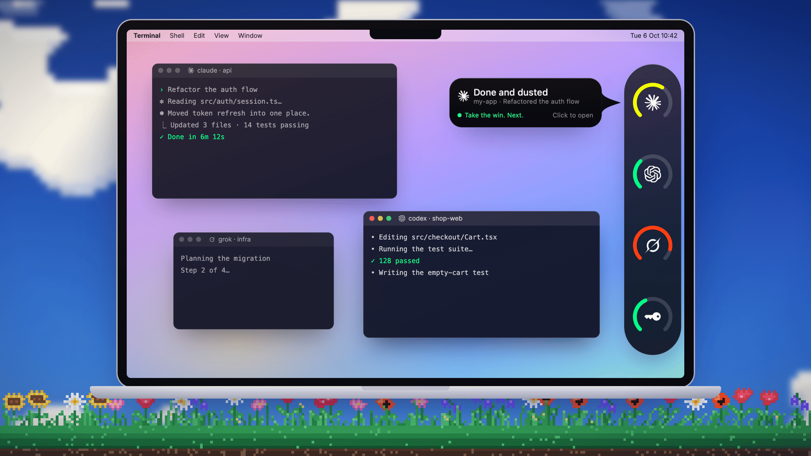

# spyx

Every coding agent, in one small pill at the edge of your screen.



**[Download spyx for macOS](https://github.com/chrisnguyen1211/spyxdotlol/releases/latest)**

Requires macOS 15 or later on Apple silicon. The lid gesture needs a MacBook;
desktop Macs get everything else. Free and open source under the MIT License.

## What it does

- **Usage at a glance.** A ring for each agent shows how much of its usage
  limit is left, with a forecast when it will run out before it resets and a
  card when it comes back.
- **Every running session.** Hover the pill to see what each agent is doing,
  with its model, reasoning effort and tokens used.
- **A card the moment an agent finishes.** Real-time, from each agent's own
  hooks. Click it to jump straight to that session.
- **Approvals from the notch.** Allow, deny or answer Claude Code's questions
  without leaving what you're doing.
- **Reply, stop or hand off.** Write to a session from the notch, or hand its
  work to another agent with a short brief.
- **Set reasoning effort with the lid.** Hold ⌘ and tilt your MacBook's lid:
  open to raise effort, close to lower it — for the agent you're working with
  (the session in view, or the one you changed last), on its model's own scale.
  Other agents keep their level.

## Supported agents

| Agent | Usage ring | Sessions | Done card | Lid effort |
|---|:---:|:---:|:---:|:---:|
| Claude Code | ✓ | ✓ | ✓ (and approvals) | ✓ |
| Codex | ✓ | ✓ | ✓ | ✓ |
| Grok | ✓ | ✓ | ✓ | ✓ |
| Cursor | ✓ | ✓ | ✓ | — |
| Kimi Code | ✓ | ✓ | ✓ | ✓ |
| GitHub Copilot (Copilot CLI) | ✓ | — | ✓ | ✓ |
| Antigravity | ✓ | ✓ | ✓ | — |
| Gemini API key (Gemini CLI, OpenCode, Hermes) | ✓ | ✓ | ✓ Gemini CLI | — |
| OpenCode | ✓ | — | ✓ | — |
| Droid | — | — | ✓ | ✓ |
| Hermes | — | — | — | ✓ |
| Devin | ✓ | — | — | — |
| GLM | ✓ | — | — | — |
| Command Code | ✓ | — | — | — |
| DeepSeek | ✓ | — | — | — |
| Ollama (local and cloud) | ✓ | model activity | — | — |
| LM Studio | ✓ | model activity | — | — |

Usage is read with the login each agent already has on your Mac; DeepSeek is
signed in once inside spyx, and Ollama cloud takes an API key. Hermes' Gemini
usage shows in the Gemini API ring. Per-model effort scales are listed in
[How it works](docs/HOW-IT-WORKS.md#where-the-level-goes).

## Install

1. Download `spyx-<version>.dmg` from the
   [latest release](https://github.com/chrisnguyen1211/spyxdotlol/releases/latest).
2. Open it and drag **spyx** onto **Applications**.
3. Open spyx from Applications. The first time, macOS may say *Apple could not
   verify "spyx" is free of malware*. Click **Done**, then open
   **System Settings → Privacy & Security**, scroll down to the message about
   spyx and click **Open Anyway**, then confirm.

spyx is not yet notarized by Apple, which is why this step is needed. It is
asked only once, updates install without it, and it goes away entirely once
releases are notarized.

## First run

A setup assistant walks through what spyx needs, one page each. Every status is
read live from macOS, and every optional step can be skipped.

- **Agents** — every supported agent with a switch. Once on, each shows
  Connected or the one thing it needs (sign in, open the app, allow access).
- **Done & approvals** — adds spyx's turn-finished hook to each agent found on
  your Mac, and Claude Code's approvals hook.
- **Terminals** — Automation for Terminal, iTerm2 and cmux, so spyx can type
  `/effort` or a reply into an idle tab and bring a session's tab forward.
  Superset, Ghostty, Warp, VS Code, Cursor, Zed, kitty and WezTerm need nothing.
- **Desktop apps** — Accessibility, shown only if the Claude or Codex app is
  installed, so spyx can set effort and reply in the Claude app session on
  screen.

The assistant ends with the ⌘ + lid gesture and a live level meter, then a
short tour. Both are in the menu bar later: **Set Up spyx…** and
**Take the Tour**.

## Privacy

spyx runs entirely on your Mac. There is no account, no analytics and no server
of ours.

**What it reads.** Each agent's own logins (its keychain item or auth file,
such as `~/.codex/auth.json`), session files and transcripts under folders like
`~/.claude`, `~/.codex` and `~/.grok`, and the Claude app's session records.
Keychain reads are only of the agents' own logins, plus an Ollama API key if
you give spyx one. Session files are never modified.

**What it writes.** When you move the lid, the one line holding each agent's
default effort (see [How it works](docs/HOW-IT-WORKS.md)). And, once you have
seen what they are in setup, its own turn-finished hook in these files — for
agents present on your Mac, with spyx in Applications — and nothing else in them:

| File | Entry |
|---|---|
| `~/.claude/settings.json` | `Stop` hook; `PermissionRequest` hook for approvals |
| `~/.codex/config.toml` | `notify` (an existing notify program is kept and still called) |
| `~/.grok/hooks/spyx.json` | spyx's own file |
| `~/.cursor/hooks.json` | `stop` hook |
| `~/.factory/settings.json` | `Stop` hook (Droid) |
| `~/.gemini/config/hooks.json` | `spyx` entry (Antigravity) |
| `~/.copilot/hooks/spyx.json` | spyx's own file |
| `~/.kimi-code/config.toml` | one `[[hooks]]` block |
| `~/.gemini/settings.json` | `AfterAgent` hook (Gemini CLI) |
| `~/.config/opencode/plugins/spyx.js` | spyx's own file |

The lid gesture rewrites the single line holding the reasoning effort in
`~/.claude/settings.json`, `~/.codex/config.toml`, `~/.grok/config.toml`,
`~/.hermes/config.yaml`, `~/.factory/settings.json`, `~/.copilot/settings.json`
and `~/.kimi-code/config.toml`. spyx's own files live in `~/.lid-effort/` and
`~/Library/Application Support/spyx/`.

**What it runs.** Occasionally `claude --print /usage` to read Claude Code's
usage, and `claude -p` to keep Claude Code's login fresh. Both use Claude
Code's own credentials and start no MCP servers.

**What it sends.** Network requests go only to each agent's own servers, to
read usage with that agent's login, and to GitHub, to check for and download
updates. Nothing else leaves your Mac. Logs stay on your Mac and contain no
message text; crash reports are kept locally and never uploaded.

**What it types.** With your permission, `/effort` and your replies, only into
the session you are looking at, only when it is idle, and never into a draft.

## Uninstall

1. Open **Settings → General** and click **Remove spyx from my agents…**. This
   takes spyx's entries out of every file listed under [Privacy](#privacy),
   leaving everything else in them as it was.
2. Quit spyx and drag it from Applications to the Trash.

Or, from Terminal, before deleting the app:

```bash
/Applications/spyx.app/Contents/MacOS/spyx --uninstall
```

To remove spyx's own data as well, delete `~/.lid-effort/` and
`~/Library/Application Support/spyx/`. The effort levels spyx wrote stay in
each agent's config as ordinary settings.

## FAQ

**How does the lid gesture work?**
MacBooks have a hinge sensor that reports the lid's angle. spyx reads it, and
only while you hold ⌘: one level per 7° of travel, applied when you let go.
Without ⌘, moving the lid changes nothing. Desktop Macs, and MacBooks without
a readable sensor, get every other feature, and effort can still be set by
dragging the bar in the notch. Details in
[How it works](docs/HOW-IT-WORKS.md#the-lid).

**Why does macOS say it can't verify spyx?**
Releases are signed but not yet notarized by Apple. Use **Open Anyway** once,
as described in [Install](#install), or build spyx yourself; a copy built on
your own Mac is never blocked.

**Why does spyx ask for Accessibility?**
To type `/effort` and your replies into a Claude app session, and to press Esc
when you stop a session. It acts only on the session on screen, only when its
message box is empty, and never types into a draft. Without it, everything else
works.

**Why does spyx ask for Automation?**
To script Terminal, iTerm2 and cmux: typing `/effort` or a reply into an idle
tab, bringing a session's tab to the front, and opening a new window when you
hand off work to another agent.

**Where do I report a problem?**
[Open an issue](https://github.com/chrisnguyen1211/spyxdotlol/issues). Settings
→ General can copy local crash reports to attach.

## Contributing and building

Requires Xcode 16 or later, Apple silicon and macOS 15 or later.

```bash
script/bundle.sh --run    # build and launch build/spyx.app
swift test
```

The gesture mechanics, per-agent details, project layout and packaging are in
[docs/HOW-IT-WORKS.md](docs/HOW-IT-WORKS.md). Releases are described in
[RELEASING.md](RELEASING.md). Issues and pull requests are welcome.

## License

MIT. See [LICENSE](LICENSE). Third-party components and their licenses are
listed in [THIRD_PARTY_NOTICES.md](THIRD_PARTY_NOTICES.md).
